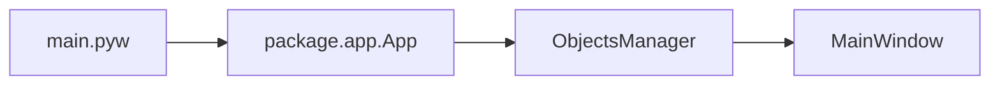

# Архитектура

Проект использует **Python 3.8.10**. Код организован в пакет `package/` с разделением на UI (компоненты, контроллеры, сгенерированный UI) и бизнес-логику (модули).

## Структура репозитория

| Каталог | Назначение |
|---------|------------|
| **package/** | Основной код: точка входа приложения (`app`), константы, импорты. |
| **package/components/** | Диалоги и виджеты UI: главное окно, диалоги настроек, списков кабелей, имён секторов и т.д. (PySide6). |
| **package/controllers/** | Стили, иконки, виджеты отображения — всё, что управляет внешним видом и ресурсами UI. |
| **package/modules/** | Бизнес-логика: диаграммы, проект, лицензия, настройки, конфиги, рисование, журнал отмены. Без прямого создания виджетов, по возможности без импортов PySide6. |
| **package/ui/** | Сгенерированный UI из Qt Designer (исходник: `mainwindow.ui` в этом же каталоге). Минимум ручных правок; переопределение поведения — в `package/components/`. |
| **configs/** | JSON-конфигурации (глобальные, узлы, соединения, списки). |
| **resources/** | Ресурсы приложения (иконки, шрифты) — подключаются через Qt resource system (`resources_rc.py` / `.qrc`). |
| **build/** | Скрипты варианта сборки (demo/full), Nuitka, установщик Inno Setup. |

## Разделение UI и логики

- Обработчики кнопок и виджетов в `components/` вызывают методы из `package/modules/`.
- Алгоритмы, работа с данными и файлами — в модулях.
- Новый функционал: UI-часть в `components/` или `controllers/`, логика и данные в `modules/`.

## Последовательность запуска



1. **main.pyw** — разбор аргументов (`--demo`/`--full`, путь к `.nce`), установка `NET_CONSTRUCTOR_MODE`, вызов `package.app.App`.
2. **package.app** — single instance (QLocalServer), создание `ObjectsManager`, инициализация путей, конфигов, проекта, настроек, стиля, иконок, журнал отмены; создание главного окна `MainWindow`.
3. **MainWindow** — работа с проектом, диаграммой, диалогами; вызов модулей рисования, проекта, конфигов.

Конфиги загружаются из каталога `configs/` относительно каталога приложения; доступ к ним — через `package.modules.configs.Configs`.

Рисование диаграмм — в `package.modules.diagramdrawer` и связанных модулях (`drawconnection`, `drawnode`, `drawobject`, `drawtext`, `drawdataparameters`, `painterconfigurator`).

## Диаграммы: типы и отрисовка

Типы диаграмм задаются в **config_global.json** в ключе `diagrams`: у каждой диаграммы есть `type_id`, `name`, массивы `id_nodes` и `id_connections` (ссылки на типы узлов и соединений из config_nodes.json и config_connections.json), а также `parameters` — параметры отображения (отступы, расстояние между рядами, шрифты, цвета и т.д.).

Текущий тип диаграммы и её параметры хранятся в данных проекта (см. [Данные проекта](project-data.md)).

Отрисовка выполняется в `package.modules.diagramdrawer`: модуль собирает узлы и соединения по конфигу, применяет параметры диаграммы и вызывает `drawconnection`, `drawnode`, `drawobject`, `drawtext`, `drawdataparameters`. Настройка кистей, перьев и шрифтов по конфигу — в `package.modules.painterconfigurator`.

Подробнее: [Рисование схемы](diagram-drawing.md). При добавлении нового типа диаграммы или изменении отрисовки правят конфиги и соответствующие модули в `package/modules/`.

## Формат файла проекта (.nce)

Файл проекта имеет расширение **.nce** и представляет собой JSON.

Структура: `diagram_type_id`, `diagram_name`, `diagram_parameters` (параметры отображения диаграммы), `control_sectors_config` (данные секторов управления), `nodes` (массив узлов), `connections` (массив соединений), `archived_parameters` (архив параметров по типам диаграмм при смене типа). Узлы и соединения содержат идентификаторы типов и данные полей, описанных в config_nodes и config_connections.

Чтение и запись выполняет `package.modules.project.Project` (`open_project`, `save_as_project`, `_write_project`). При открытии файла данные загружаются в память; при сохранении — записываются через `json.dump` с отступами и UTF-8.

Подробнее: [Данные проекта](project-data.md).

## Ресурсы и оформление

Иконки и шрифты расположены в каталоге **resources/** в корне проекта.

Подключение — через Qt resource system: файл `resources.qrc` описывает ресурсы, из него генерируется `resources_rc.py`; в коде ресурсы доступны по префиксу `:/` или через импорт `resources_rc`. Не следует хардкодить пути к `resources/` из произвольных модулей; стили и иконки настраиваются в `package/controllers/` (например, стили приложения, виджеты отображения).

### Каталог ресурсов

- **Шрифты** (префикс `fonts/`): OpenSans Variable — обычный и Italic (`resources/fonts/OpenSans-VariableFont_wdth,wght.ttf`, `OpenSans-Italic-VariableFont_wdth,wght.ttf`).
- **Иконка приложения** (префикс `app/`): `app-icon.svg`. Для иконки exe в проводнике Windows при сборке используется отдельно сгенерированный `resources/app-icon.ico` (скрипт `build/build_icon.py`).
- **PNG** (префиксы `png/`, `black-png/`, `white-png/`): одни и те же имена файлов в трёх вариантах (тема). Назначение: ветки дерева (`branch-closed.png`, `branch-open.png`), чекбокс (`checkbox-check.png`, `checkbox-check-disabled.png`), комбобокс (`combobox-down.png`), скроллбары по сторонам и состояниям (`scrollbar-down/up/left/right.png`, `*-disabled.png`, `*-hover.png`), сортировка (`sort-asc.png`, `sort-desc.png`), спиннер (`spinner-down.png`, `spinner-up.png`), стрелка подменю (`sub-menu-arrow.png`, `sub-menu-arrow-hover.png`).
- **Иконки UI** (префиксы `white-icons/`, `black-icons/`): выбор префикса по теме (светлая/тёмная) — в [package.controllers.icons](api/components.md). Имена файлов и назначение:

| Имя | Назначение |
|-----|------------|
| add-file, open, save, close | Файл: новый, открыть, сохранить, закрыть |
| export, pdf, picture | Экспорт, PDF, изображение |
| folder, file-text, page | Папка, файл, страница |
| edit, pen, text, longtext, text-editor | Редактирование, текст |
| table, table-columns, table-rows, items-list, items-tree | Таблицы, списки, дерево |
| plus, trash | Добавить, удалить |
| zoom-in, zoom-out, zoom-fit-width | Масштаб |
| undo, redo | Отмена, повтор |
| settings, show-properties | Настройки, свойства |
| calendar, template, green-circle | Календарь, шаблон, индикатор |

При добавлении новых иконок или шрифтов их регистрируют в `.qrc` и пересобирают ресурсы. Регенерация из корня проекта:

```bash
pyside6-rcc resources.qrc -o resources_rc.py
```

## Журнал отмены (Undo)

Журнал отмены действий реализован в `package.modules.undojournal`; объект журнала доступен через менеджер объектов (главное окно).

При изменении данных проекта (узлы, соединения, секторы, параметры диаграммы) действия записываются в журнал; пользователь может отменить или повторить последние шаги. При добавлении нового функционала, меняющего данные проекта, нужно обеспечивать запись соответствующих команд в журнал отмены, чтобы Undo/Redo работали корректно.

Подробнее: [Журнал отмены](undo-journal.md).
