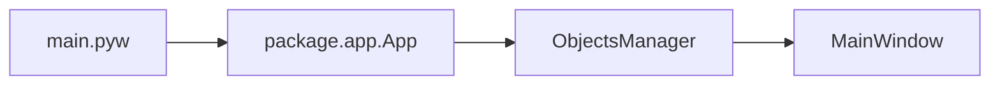

# Архитектура

Проект использует **Python 3.8**. Код организован в пакет `package/` с разделением на UI (компоненты, контроллеры, сгенерированный UI) и бизнес-логику (модули).

## Структура репозитория

| Каталог | Назначение |
|---------|------------|
| **package/** | Основной код: точка входа приложения (`app`), константы, импорты. |
| **package/components/** | Диалоги и виджеты UI: главное окно, диалоги настроек, списков кабелей, имён секторов и т.д. (PySide6). |
| **package/controllers/** | Стили, иконки, виджеты отображения — всё, что управляет внешним видом и ресурсами UI. |
| **package/modules/** | Бизнес-логика: диаграммы, проект, лицензия, настройки, конфиги, рисование, undo. Без прямого создания виджетов, по возможности без импортов PySide6. |
| **package/ui/** | Сгенерированный UI из Qt Designer (исходник: `mainwindow.ui` в этом же каталоге). Минимум ручных правок; переопределение поведения — в `package/components/`. |
| **configs/** | JSON-конфигурации (глобальные, узлы, соединения, списки). |
| **resources/** | Ресурсы приложения (иконки, шрифты) — подключаются через Qt resource system (`resources_rc.py` / `.qrc`). |
| **build/** | Скрипты варианта сборки (demo/full), Nuitka, установщик Inno Setup. |

## Разделение UI и логики

- Обработчики кнопок и виджетов в `components/` вызывают методы из `package/modules/`.
- Алгоритмы, работа с данными и файлами — в модулях.
- Новый функционал: UI-часть в `components/` или `controllers/`, логика и данные в `modules/`.

## Поток запуска

1. **main.pyw** — разбор аргументов (`--demo`/`--full`, путь к `.nce`), установка `NET_CONSTRUCTOR_MODE`, вызов `package.app.App`.
2. **package.app** — single instance (QLocalServer), создание `ObjectsManager`, инициализация путей, конфигов, проекта, настроек, стиля, иконок, undo; создание главного окна `MainWindow`.
3. **MainWindow** — работа с проектом, диаграммой, диалогами; вызов модулей рисования, проекта, конфигов.

Конфиги загружаются из каталога `configs/` относительно каталога приложения; доступ к ним — через `package.modules.configs.Configs`. Рисование диаграмм — в `package.modules.diagramdrawer` и связанных модулях (`drawconnection`, `drawnode`, `drawobject`, `drawtext`, `drawdataparameters`, `painterconfigurator`).
