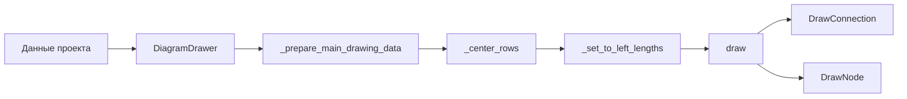

# Рисование схемы

Описывается процесс построения изображения диаграммы по данным проекта: входные данные, цепочка вызовов и бизнес-правила.

Код: [package.controllers.imagewidget](api/components.md#package.controllers.imagewidget) (виджет изображения), [package.modules.diagramdrawer](api/modules.md#package.modules.diagramdrawer), [package.modules.drawnode](api/modules.md#package.modules.drawnode), [package.modules.drawconnection](api/modules.md#package.modules.drawconnection), [package.modules.painterconfigurator](api/modules.md#package.modules.painterconfigurator).

## Входные данные

- **Данные проекта** (словарь из [package.modules.project](api/modules.md#package.modules.project)): `nodes`, `connections`, `diagram_type_id`, `diagram_parameters`, `control_sectors_config`. У каждого узла/соединения — идентификатор типа, поля `data`, `parameters`, у соединений — массив `control_sectors`.
- **Конфиги:** типы узлов и соединений из [config_nodes.json](configs.md#config_nodesjson) и [config_connections.json](configs.md#config_connectionsjson); параметры диаграммы для текущего `diagram_type_id` из [config_global.json](configs.md#config_globaljson) (ключ `diagrams`).

Параметры отображения берутся из `diagram_parameters`: `indent_left`, `indent_top`, `indent_right`, `indent_bottom`, `delta_wrap_y`, `is_center`, `max_nodes_in_row`.

## Цепочка вызовов

1. **Виджет изображения** ([package.controllers.imagewidget](api/components.md#package.controllers.imagewidget)) при обновлении диаграммы вызывает `run(data)`. Создаётся `DiagramDrawer(obsm, data)` и вызывается `create_image(data)`.
2. **create_image:** из `data["diagram_parameters"]` читаются отступы и параметры (`indent_left`, `indent_top`, `indent_right`, `indent_bottom`, `delta_wrap_y`, `is_center`, `max_nodes_in_row`). Вызывается `_preparation_draw(start_x, start_y, delta_wrap_y, indent_right, is_center, max_nodes_in_row)` для расчёта размеров и подготовки списка элементов; по количеству строк вычисляется высота изображения. Создаётся итоговое `QImage`, на нём вызывается `diagram_drawer.draw(painter, start_x, delta_wrap_y)`.
3. **_preparation_draw** (в [diagramdrawer](api/modules.md#package.modules.diagramdrawer)):
   - **_prepare_main_drawing_data:** обход массивов `nodes` и `connections` по индексу. Для каждого узла создаётся обёртка `Node(node, config_node)`; при достижении `max_nodes_in_row` или при флаге переноса строки (`is_wrap`) открывается новая строка (`rows.new_row`), координата y увеличивается на `delta_wrap_y`. Для каждого соединения создаётся обёртка `Connection(connection, config_connection)`; накапливаются оптическая и физическая длины для подписей. Для типа соединения `"100"` в список добавляются контрольные секторы с координатами и флагами переноса. Итог: список элементов `prepared_data` (узлы и соединения в порядке следования), объект `Rows` с координатами строк.
   - По `rows` вычисляется максимальная ширина, задаётся `width = max_x + indent_right`.
   - **_center_rows:** при `is_center == True` каждая строка сдвигается по x так, чтобы середина строки совпадала с центром ширины.
   - **_set_to_left_lengths:** для каждого элемента добавляются накопленные «длины слева» (оптическая и физическая) для подписей.
   Результат сохраняется в `self.prepared_data`.
4. **draw(painter, start_x, delta_wrap_y):** обход `prepared_data`. Для каждого элемента типа `connection` вызывается **_draw_connection** (модуль [drawconnection](api/modules.md#package.modules.drawconnection)): отрисовка линии соединения и контрольных секторов. Для каждого элемента типа `node` вызывается **_draw_node** (модуль [drawnode](api/modules.md#package.modules.drawnode)): отрисовка формы узла и подписей; в узёл передаются соседи (до/после) и длины для подписей.

Кисти, перья и шрифты настраиваются по конфигу в [package.modules.painterconfigurator](api/modules.md#package.modules.painterconfigurator).

## Бизнес-правила

- Узлы и соединения отображаются **в порядке** массивов `nodes` и `connections` (чередование: узел — соединение — узел — …).
- **Перенос строки:** при достижении в строке числа узлов `max_nodes_in_row` или при флаге узла `is_wrap` начинается новая строка; смещение по y — `delta_wrap_y`. Для контрольных секторов (тип соединения `"100"`) перенос обрабатывается аналогично по `max_nodes_in_row` и флагу сектора `is_wrap`.
- **Форма узла и подписи** зависят от `diagram_type_id`: в [drawnode](api/modules.md#package.modules.drawnode) ветвление по значениям `"0"`, `"50"`, `"100"`, `"150"` (разные варианты отрисовки вершины и подписей).
- **Центрирование:** при включённом параметре `is_center` каждая строка схемы сдвигается по горизонтали так, чтобы её середина совпадала с центром итоговой ширины изображения.

## Схема потока

Данные проекта и конфиги поступают в `DiagramDrawer`. Подготовка строит список элементов и координаты; затем при необходимости центрирование и расчёт длин для подписей. Метод `draw` обходит подготовленный список и рисует соединения и узлы через `DrawConnection` и `DrawNode`.
